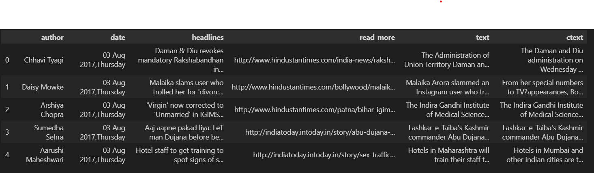
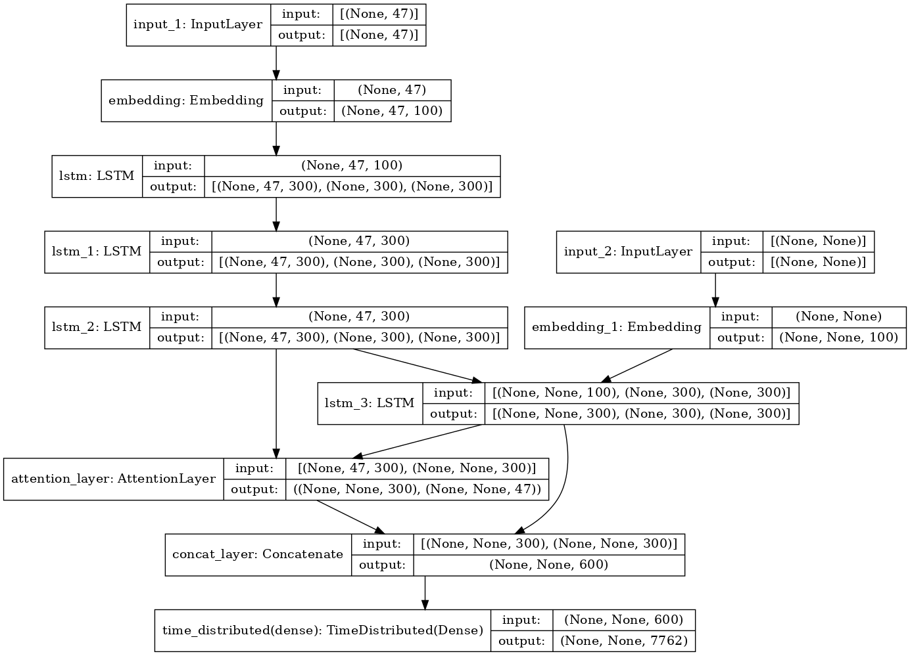
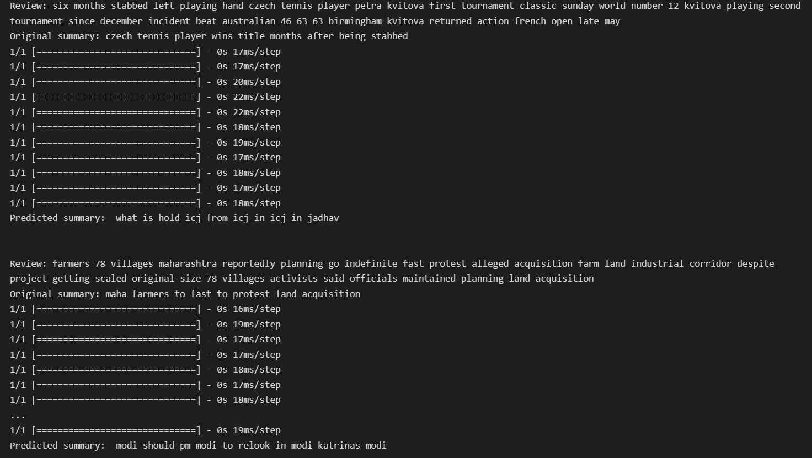

# News Headline generator

As the title explains,  I have build a model which generates headlines for a news, this model is 78% accurate and I aim to improve this in future, now lets look walk through the code.

1. Dataset

We have used the dataset called [news_summary.csv(from kaggle)](https://www.kaggle.com/datasets/sunnysai12345/news-summary)

The dataset consists of 4515 examples and contains Author_name, Headlines, Url of Article, Short text, Complete Article. I gathered the summarized news from Inshorts and only scraped the news articles from Hindu, Indian times and Guardian. Time period ranges from febrauary to august 2017.

Lets Look at the head of the dataset

2. Data Cleaning and preprocessing

In the notebook title `data_cleaning.ipynb` we have done preprocessing on news and the headlines to by removing unwanted things from the text that do not contribute to reach the goal. Please check out the notebook for further details

3. Data modeling

Please check out notebook titled `data_modeling.ipynb`

Lets look at the model

We have used **attention layer** in this,

The Intuition behind the Attention Mechanism
How much attention do we need to pay to every word in the input sequence for generating a word at timestep t? That’s the key intuition behind this attention mechanism concept.

Let’s consider a simple example to understand how Attention Mechanism works:

Source sequence: “Which sport do you like the most?
Target sequence: “I love cricket”
The first word ‘I’ in the target sequence is connected to the fourth word ‘you’ in the source sequence, right? Similarly, the second-word ‘love’ in the target sequence is associated with the fifth word ‘like’ in the source sequence.

So, instead of looking at all the words in the source sequence, we can increase the importance of specific parts of the source sequence that result in the target sequence. This is the basic idea behind the attention mechanism.

4. Lets look at some examples

5. Further steps

Now we know from the examples that the model is not that accurate, so we need to improve this further

Future steps to imporve the model:

1. Increase the dataset
2. Hypertuning the parameters
3. Change the encoder structure
4. Train for longer time

Author: Smit Shah :smiley:
